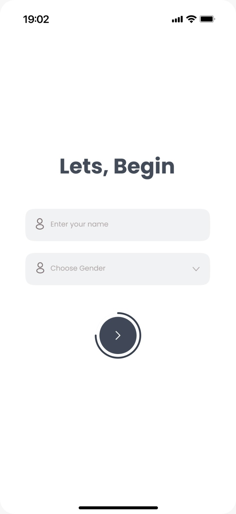
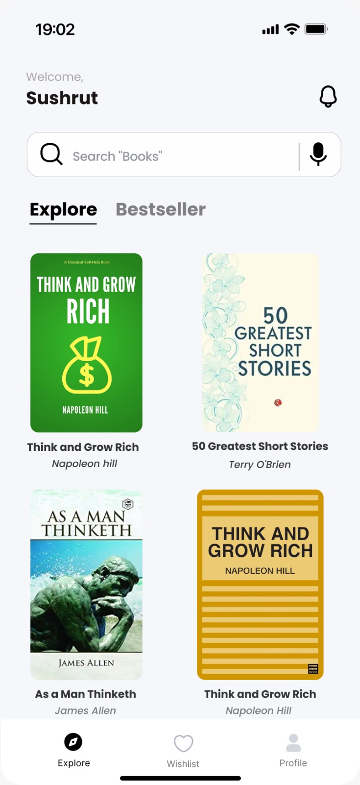
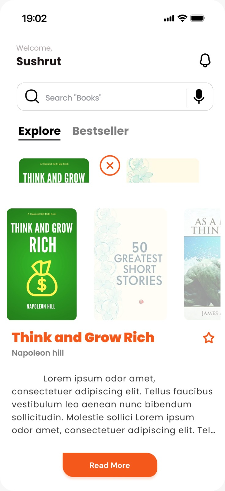
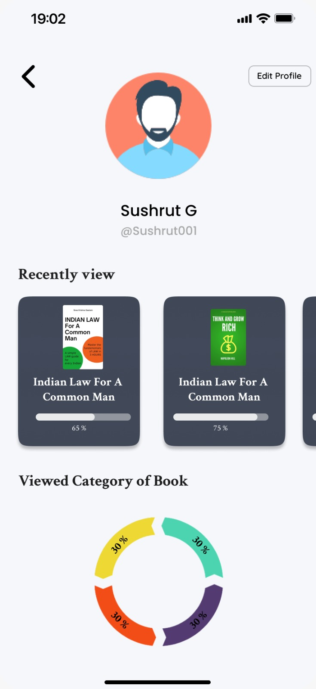

# 📚 Bookify App 

  
   

  <h3 align="center">
    <a href="https://github.com/piyushlasane/bookify">GitHub Repo</a>
     | 
    <a href="https://github.com/piyushlasane/bookify/releases/latest/download/bookify.apk">App Download</a>
     | 
    <a href="https://www.figma.com/community/file/1506295342771705504/bookify-app-design">Figma Design</a>
  </h3>

<h2 align="center">📱 Scan to Try the App</h2>

  

--- 
## About

*Bookify* is a modern Android application built to provide users with a seamless book discovery and management experience. Users can explore book listings, save favorites, and interact with the app through a user-friendly interface. This project leverages modern Android development tools and integrates external APIs for enhanced functionality.

---

## ✨ Features

- 📚 *Book Discovery*: Browse and explore books using the Google Books API.
- 🔍 *Real-time Search*: Search for books with instant results as you type. 
- 🌙 *Dark Mode Support*: Toggle between light and dark themes for comfortable reading.
- 📱 *Modern UI*: Built using the latest Material Design principles with Jetpack Compose and XML. 
- 🌐 *API Integration*: Uses Retrofit for efficient networking with external APIs.
- 🎨 *Custom UI/UX Design*: Intuitive layouts designed in Figma for seamless mobile experience.
- 🔄 *Reusable Components*: Modular and reusable UI components for scalability. 

---

## 🚀 Technologies Used

### 💻 Android Development
- *Java* — Modern programming language for Android
- *XML* — Declarative UI / traditional UI layout
- *Android Studio* — IDE used for development
- *Gradle (KTS)* — Kotlin-based Gradle build scripts
 
### 🌐 API Integration
- *Google Books API* — To fetch book data
- **Retrofit ** — HTTP client for networking (based on your implementation)

---

---

## 🎨 User Interface (UI) Overview

The Bookify app is designed with a clean, modern, and intuitive user interface following *Material You* principles. Here's an overview of the UI screens included in the application:

| Screen                 | Description                                                  |
|------------------------|--------------------------------------------------------------|
| 📚 Home Screen          | Displays trending or recommended books.                      |
| 🔍 Search Screen        | Real-time search input for books via API.                    |
| ❤ Favorites Screen     | List of user-saved books for quick access.                   |
| 📘 Book Detail          | Detailed view with description, author & rating.             |
| 👤 Profile Screen       | View user details like name, email, and reading stats.       |
| ✏ Profile Update Screen| Allows editing user details and profile picture.             |
| ⚙ Settings             | Toggle light/dark mode, preferences.                         |

Figma Design Preview: [🔗 Click me]( https://www.figma.com/community/file/1506295342771705504/bookify-app-design)

---

### 📸 UI Screenshots (Optional)

You can include screenshots here like:
### 📱 Login Page 

  
  

### 📱 Main Page  

   

### 📱 Book Detail 

   

### 📱 Favorites Screen  

   
   

### 📱 Profile Update Screen  

   
   

  

---

## 🛠 Teammates

We are grateful to these wonderful people who contributed to Bookify.  

<table>
  <tbody>
    <tr>
       <td align="center">
        <a href="https://github.com/piyushlasane">
           
          <b>Piyush Lasane</b>
        </a> 
        <a href="https://github.com/sushrut-001/bookify/commits?author=piyushlasane" title="Code">💻</a>
        <a href="#design-piyushlasane" title="Design">🎨</a>
        <a href="#testing-piyushlasane" title="Testing">⚠</a>
        <a href="#doc-piyushlasane" title="Documentation">📖</a>
      </td>
      <td align="center">
        <a href="https://github.com/Sushrut_001">
           
          <b>Sushrut G</b>
        </a> 
        <a href="https://github.com/sushrut-001/bookify/commits?author=Sushrut_001" title="Code">💻</a>
        <a href="#design-Sushrut_001" title="Design">🎨</a>
        <a href="#infra-Sushrut_001" title="Infrastructure">🚇</a>
        <a href="#projectManagement-Sushrut_001" title="Project Management">📆</a>
        <a href="#maintenance-Sushrut_001" title="Maintenance">🚧</a>
      </td>
     
  </tbody>
</table>
<!-- ALL-CONTRIBUTORS-LIST:END -->
<!-- markdownlint-enable -->
<!-- prettier-ignore-end -->
<!-- ALL-CONTRIBUTORS-LIST:END -->

#
